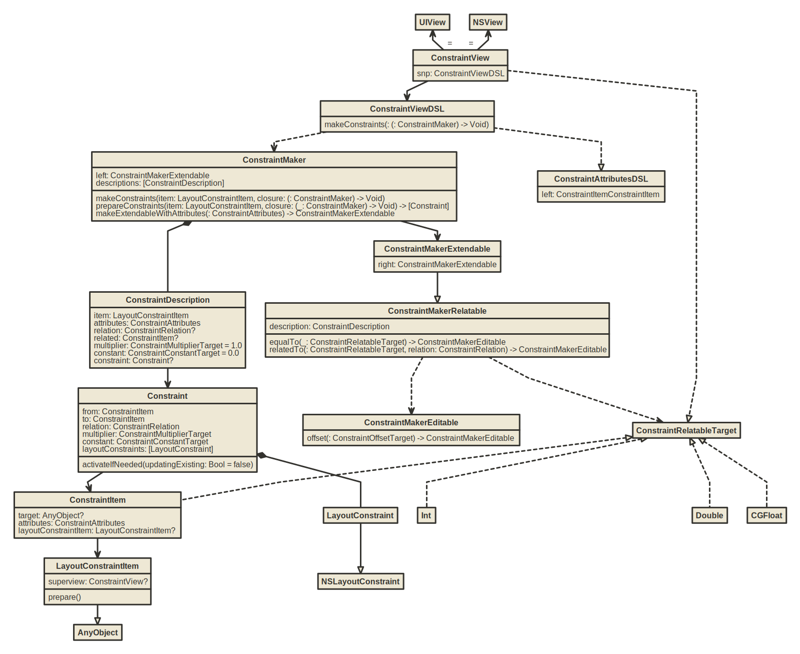

SnapKit is a DSL to make Auto Layout easy on both iOS and OS X.

[](https://travis-ci.org/SnapKit/SnapKit)
[](https://github.com/SnapKit/SnapKit)
[](https://cocoapods.org/pods/SnapKit)
[](https://github.com/Carthage/Carthage)

#### ⚠️ **To use with Swift 4.x please ensure you are using >= 4.0.0** ⚠️
#### ⚠️ **To use with Swift 5.x please ensure you are using >= 5.0.0** ⚠️

## Analysis

### UML


[SnapKitUML类图](https://www.nomnoml.com/#view/%5BConstraintView%0A%7C%20snp%3A%20ConstraintViewDSL%0A%5D%0A%0A%5BConstraintViewDSL%0A%7C%20makeConstraints(%3A%20(%3A%20ConstraintMaker)%20-%3E%20Void)%0A%5D%0A%0A%5BConstraintAttributesDSL%0A%7C%20left%3A%20ConstraintItemConstraintItem%0A%5D%0A%0A%5BConstraintMaker%0A%7C%20left%3A%20ConstraintMakerExtendable%3B%0Adescriptions%3A%20%5C%5BConstraintDescription%5C%5D%0A%0A%7C%20makeConstraints(item%3A%20LayoutConstraintItem%2C%20closure%3A%20(%3A%20ConstraintMaker)%20-%3E%20Void)%3B%0AprepareConstraints(item%3A%20LayoutConstraintItem%2C%20closure%3A%20(_%3A%20ConstraintMaker)%20-%3E%20Void)%20-%3E%20%5C%5BConstraint%5C%5D%3B%0AmakeExtendableWithAttributes(%3A%20ConstraintAttributes)%20-%3E%20ConstraintMakerExtendable%0A%5D%0A%0A%5BConstraintMakerExtendable%0A%7C%20right%3A%20ConstraintMakerExtendable%0A%5D%0A%0A%5BConstraintMakerRelatable%0A%7C%20description%3A%20ConstraintDescription%0A%0A%7C%20equalTo(_%3A%20ConstraintRelatableTarget)%20-%3E%20ConstraintMakerEditable%3B%0ArelatedTo(%3A%20ConstraintRelatableTarget%2C%20relation%3A%20ConstraintRelation)%20-%3E%20ConstraintMakerEditable%0A%5D%0A%0A%5BConstraintMakerEditable%0A%7C%20offset(%3A%20ConstraintOffsetTarget)%20-%3E%20ConstraintMakerEditable%0A%5D%0A%0A%5BConstraintDescription%0A%7C%20item%3A%20LayoutConstraintItem%3B%0Aattributes%3A%20ConstraintAttributes%3B%0Arelation%3A%20ConstraintRelation%3F%3B%0Arelated%3A%20ConstraintItem%3F%3B%0Amultiplier%3A%20ConstraintMultiplierTarget%20%3D%201.0%3B%0Aconstant%3A%20ConstraintConstantTarget%20%3D%200.0%3B%0Aconstraint%3A%20Constraint%3F%0A%5D%0A%0A%5BConstraint%0A%7C%20from%3A%20ConstraintItem%3B%0Ato%3A%20ConstraintItem%3B%0Arelation%3A%20ConstraintRelation%3B%0Amultiplier%3A%20ConstraintMultiplierTarget%3B%0Aconstant%3A%20ConstraintConstantTarget%3B%0AlayoutConstraints%3A%20%5C%5BLayoutConstraint%5C%5D%0A%0A%7C%20activateIfNeeded(updatingExisting%3A%20Bool%20%3D%20false)%0A%5D%0A%0A%5BConstraintItem%0A%7C%20target%3A%20AnyObject%3F%3B%0Aattributes%3A%20ConstraintAttributes%3B%0AlayoutConstraintItem%3A%20LayoutConstraintItem%3F%0A%5D%0A%0A%5BLayoutConstraintItem%0A%7C%20superview%3A%20ConstraintView%3F%0A%7C%20prepare()%0A%5D%0A%0A%0A%0A%5BConstraintViewDSL%5D%20--%3A%3E%20%5BConstraintAttributesDSL%5D%0A%5BConstraintMakerExtendable%5D%20-%3A%3E%20%5BConstraintMakerRelatable%5D%0A%0A%5BUIView%5D%20%3C-%3D%20%5BConstraintView%5D%0A%5BNSView%5D%20%3C-%3D%20%5BConstraintView%5D%20%0A%5BConstraintView%5D%20-%3E%20%5BConstraintViewDSL%5D%0A%5BConstraintViewDSL%5D%20--%3E%20%5BConstraintMaker%5D%0A%5BConstraintMaker%5D%20-%3E%20%5BConstraintMakerExtendable%5D%0A%5BConstraintMakerRelatable%5D%20--%3E%20%5BConstraintMakerEditable%5D%0A%5BConstraintMaker%5D%20%2B-%20%5BConstraintDescription%5D%0A%5BConstraintDescription%5D%20-%3E%20%5BConstraint%5D%0A%5BConstraint%5D%20-%3E%20%5BConstraintItem%5D%0A%5BConstraint%5D%20%2B-%20%5BLayoutConstraint%5D%0A%5BConstraintItem%5D%20-%3E%20%5BLayoutConstraintItem%5D%0A%5BLayoutConstraintItem%5D%20-%3A%3E%20%5BAnyObject%5D%0A%5BLayoutConstraint%5D%20-%3A%3E%5BNSLayoutConstraint%5D%0A%0A%5BConstraintMakerRelatable%5D%20--%3E%20%5BConstraintRelatableTarget%5D%0A%5BConstraintRelatableTarget%5D%20%3C%3A--%20%5BInt%5D%0A%5BConstraintRelatableTarget%5D%20%3C%3A--%20%5BDouble%5D%0A%5BConstraintRelatableTarget%5D%20%3C%3A--%20%5BCGFloat%5D%0A%5BConstraintRelatableTarget%5D%20%3C%3A--%20%5BConstraintItem%5D%0A%0A%5BConstraintView%5D%20--%3A%3E%20%5BConstraintRelatableTarget%5D%0A%0A%0A%0A%0A%0A%0A%0A%0A%0A%0A%0A%0A)

[返回首页](../README.md)

## Contents

- [Analysis](#analysis)
  - [UML](#uml)
- [Contents](#contents)
- [Requirements](#requirements)
- [Communication](#communication)
- [Installation](#installation)
  - [CocoaPods](#cocoapods)
  - [Carthage](#carthage)
  - [Swift Package Manager](#swift-package-manager)
  - [Manually](#manually)
- [Usage](#usage)
  - [Quick Start](#quick-start)
  - [Playground](#playground)
  - [Resources](#resources)
- [Credits](#credits)
- [License](#license)

## Requirements

- iOS 10.0+ / Mac OS X 10.12+ / tvOS 10.0+
- Xcode 10.0+
- Swift 4.0+

## Communication

- If you **need help**, use [Stack Overflow](http://stackoverflow.com/questions/tagged/snapkit). (Tag 'snapkit')
- If you'd like to **ask a general question**, use [Stack Overflow](http://stackoverflow.com/questions/tagged/snapkit).
- If you **found a bug**, open an issue.
- If you **have a feature request**, open an issue.
- If you **want to contribute**, submit a pull request.


## Installation

### CocoaPods

[CocoaPods](http://cocoapods.org) is a dependency manager for Cocoa projects. You can install it with the following command:

```bash
$ gem install cocoapods
```

> CocoaPods 1.1.0+ is required to build SnapKit 4.0.0+.

To integrate SnapKit into your Xcode project using CocoaPods, specify it in your `Podfile`:

```ruby
source 'https://github.com/CocoaPods/Specs.git'
platform :ios, '10.0'
use_frameworks!

target '<Your Target Name>' do
    pod 'SnapKit', '~> 5.0.0'
end
```

Then, run the following command:

```bash
$ pod install
```

### Carthage

[Carthage](https://github.com/Carthage/Carthage) is a decentralized dependency manager that builds your dependencies and provides you with binary frameworks.

You can install Carthage with [Homebrew](http://brew.sh/) using the following command:

```bash
$ brew update
$ brew install carthage
```

To integrate SnapKit into your Xcode project using Carthage, specify it in your `Cartfile`:

```ogdl
github "SnapKit/SnapKit" ~> 5.0.0
```

Run `carthage update` to build the framework and drag the built `SnapKit.framework` into your Xcode project.

### Swift Package Manager

[Swift Package Manager](https://swift.org/package-manager/) is a tool for managing the distribution of Swift code. It’s integrated with the Swift build system to automate the process of downloading, compiling, and linking dependencies.

> Xcode 11+ is required to build SnapKit using Swift Package Manager.

To integrate SnapKit into your Xcode project using Swift Package Manager, add it to the dependencies value of your `Package.swift`:

```swift
dependencies: [
    .package(url: "https://github.com/SnapKit/SnapKit.git", .upToNextMajor(from: "5.0.1"))
]
```

### Manually

If you prefer not to use either of the aforementioned dependency managers, you can integrate SnapKit into your project manually.

---

## Usage

### Quick Start

```swift
import SnapKit

class MyViewController: UIViewController {

    lazy var box = UIView()

    override func viewDidLoad() {
        super.viewDidLoad()

        self.view.addSubview(box)
        box.backgroundColor = .green
        box.snp.makeConstraints { (make) -> Void in
           make.width.height.equalTo(50)
           make.center.equalTo(self.view)
        }
    }

}
```

### Playground
You can try SnapKit in Playground.

**Note:**

> To try SnapKit in playground, open `SnapKit.xcworkspace` and build SnapKit.framework for any simulator first.

### Resources

- [Documentation](http://snapkit.io/docs/)
- [F.A.Q.](http://snapkit.io/faq/)

## Credits

- Robert Payne ([@robertjpayne](https://twitter.com/robertjpayne))
- Many other contributors

## License

SnapKit is released under the MIT license. See LICENSE for details.
